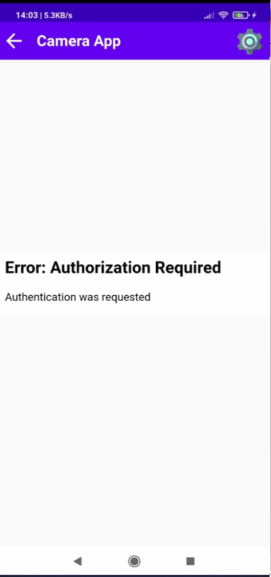
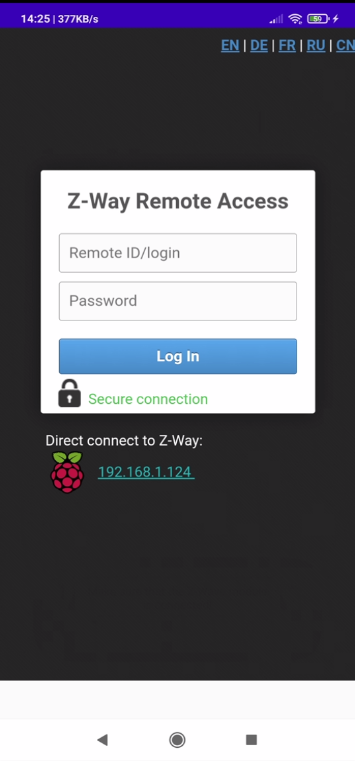

# HomeAutomationApp
An Android application for monitoring and controlling devices around the house.

The main purpose of this app was to bring together some already-existing technology in my house and provide a simple & clean UI to monitor and controll them. Also, it provided a good training and exercise in the Android development area.

User interface of the app is developed in Android Studio.
Raspberry Pi is the backend of the app that runs Python scripts to send/receive data to and from the database. 
Firebase is the web API that is used to connect the two where we use a Real Time Database for sharing data.
The RPI has connected to it LEDs, a temperature sensor (DHT11) and a Z-Wave module that provides connection to Z-Wave devices (in my case, a smart socket and a temperature/humidity sensor). The IP camera is connected to the same network as the RPI and smartphone.

Firebase is used to link the two and provide real-time data about the DHT11 sensor and LEDs.

Here is how the main menu of the app looks like:

  

The first app is called "Temperature App" and it's an activity that listenes for changes made in the "DHT11" node of the Real Time Database. The RPI runs the temperature script that sends data to the database whenever the sensor detects changes in humidity & temperature.

  
  
  

The second app is called "LED App" and it's an activity that changes the color of the LEDs connected to the RPI with the help of a script. It can turn on 2 normal red LEDs and one RGB LED with multiple colors. It also features animations for every color change; animations were synchronised to match the real life color change (see the video section).

Normal LEDs:

  
  
  

RGB LED:

  
  
  

The third app is called "IP Camera App" and it's an app ment to access an IP Camera URL. The main part features a web view that loads the given URL and a gear icon in the top-left part of the app. The gear icon brings us to the settings page where we input the IP, username and password required in the URL. After clicking the submit button, the URL is saved in the phone's memory.

  
  
  

The fourth and final app is called "ZWave App" and it's an app ment to controll ZWave compatible devices. The RPI has a server module connected to it that hosts the ZWave server. The app loads the ZWave remote URL ("https://find.z-wave.me/zboxweb/r//") where you input your RemoteId, login and password to enter the dashboard. There, you can see your already connected devices, you can add and remove devices, toggle them, and so on.
!Note! The dashboard was not made by me! I merely made the connection to the default ZWave remote URL in the application.

  
  
  

Link to demo videos: https://drive.google.com/drive/folders/132qKDnEFe9LzbR2WHRT7ukvcjjZBbYHf?usp=sharing

